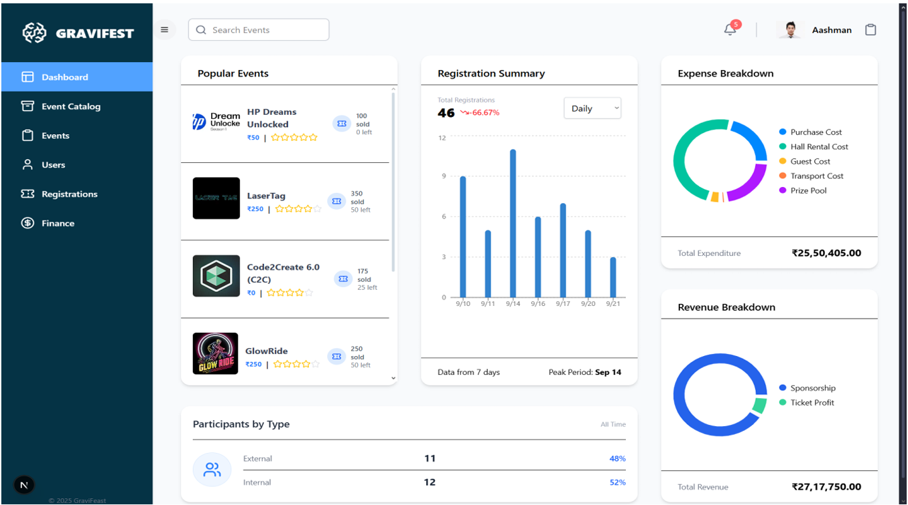
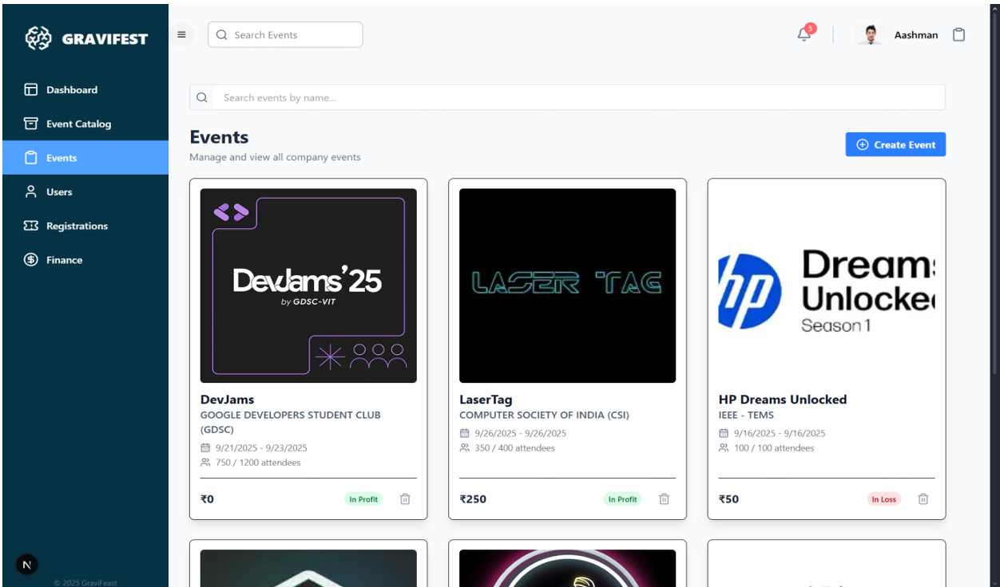
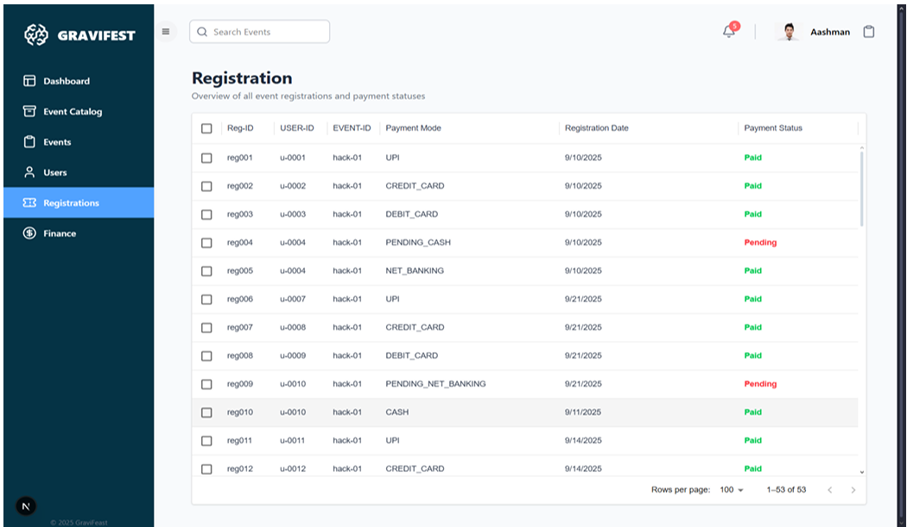
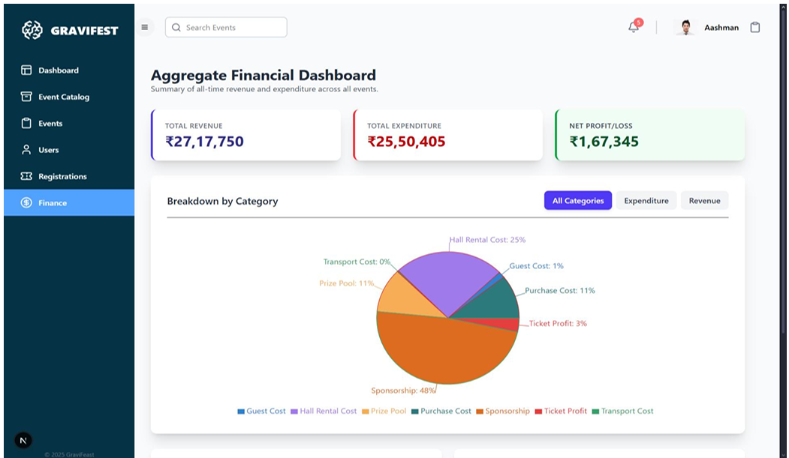

# Gravi-Fest (Gravi-Track Analytics Dashboard)

Gravi-Fest (Gravi-Track) is an event analytics and management dashboard developed to support the operational planning and monitoring of large-scale university festivals. The system provides a centralized view of event registrations, financial data, and participant information, enabling organizers to make informed, data-driven decisions during the fest.

---

## Abstract

University festivals generate large volumes of operational data related to events, participants, and finances. In many cases, this data is maintained using disconnected tools such as spreadsheets and manual records, leading to limited visibility and reactive decision-making. Gravi-Track addresses this issue by consolidating multiple data sources into a single analytics dashboard, offering real-time insights into festival performance and resource utilization.

---

## Objectives

- Design a centralized analytics dashboard for festival operations  
- Reduce data fragmentation across events, users, and financial records  
- Provide real-time visibility into registrations, revenue, and expenses  
- Propose a scalable, cloud-native system architecture for high-traffic scenarios  

---

## Key Features

- Dashboard view summarizing registrations and popular events  
- Event catalog displaying financial status (profit or loss)  
- Admin interface for managing events  
- User and registration tracking modules  
- Aggregate financial analysis and breakdowns  

---

## Technology Stack

### Frontend
- Next.js  
- TypeScript  
- React  

### Backend
- Node.js  
- Express  
- Prisma ORM  

### Database
- PostgreSQL  

---

## System Architecture (Design Overview)

The system is designed using a cloud-native architecture based on AWS services. The frontend is intended to be hosted on AWS Amplify, with static assets stored in Amazon S3. API requests are routed through API Gateway to a Node.js backend deployed using Elastic Beanstalk on EC2 instances. Data persistence is handled using a PostgreSQL database hosted on Amazon RDS.

Deployment was not completed due to time and environment constraints; however, the complete system design and implementation are documented.

---

## User Interface Overview

The project report includes screenshots demonstrating the following modules:

- Main dashboard with analytics widgets  
- Event catalog and event management views  
- User and registration tables  
- Financial summary and breakdown dashboards  

These screenshots represent the implemented frontend components and workflows.

---
## Screenshots

### Dashboard
Overview of the analytics dashboard showing popular events, registration summary, and participant distribution.
  

---

### Event Catalog
Tabular view of all events with organiser details, ticket information, and profit/loss status.
  

---

### Event Creation
Admin interface for creating new events with registration fee, ticket count, and date details.
  

---

### Events View
Card-based layout for managing and viewing all events.
  

---

### Users List
Centralized registry of registered users with detailed profile and APPAR ID status.
  

---

### Registrations
Log of all event registrations with payment mode and payment status.
  

---

### Finance Overview
Aggregate financial dashboard summarizing revenue, expenditure, and net profit or loss.
  

---

### Finance Breakdown
Detailed breakdown of expenses and revenue by category.
  

---

## Deployment Status

The application is not currently deployed. The repository contains the complete source code, database schema, and UI implementation as part of an academic submission.

---

## Project Structure

gravifest/
├── client/ # Frontend application
├── server/ # Backend services and APIs
└── README.md

---

## Credits

This project was developed as part of a B.Tech academic project.

